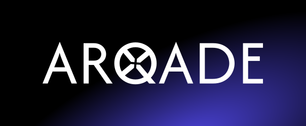

<div align="center">
  

  ### ARQADE by [mariware](https://github.com/mariware)
  Cascade into your own arcade.
</div>

## 📖 Features 

**ARQADE** is a mock digital game store designed to showcase a curated catalog of games. Users can browse titles, explore game pages, and simulate the shopping cart experience within a sleek and responsive interface. 

- 🕹️ **Game Catalog**: Browse a curated selection of games.  
- 📄 **Game Details**: View ratings, estimated playtime, and screenshots on dedicated pages.  
- 🛒 **Cart & Checkout**: Add games to your cart and calculate totals.  
- 🔎 **Database Queries**: Includes built-in database query handling.  
- 🎨 **Responsive Design**: Works seamlessly across desktop, tablet, and mobile.

## 🚀 Tech Stack

This project leverages the following modern web development stack:  

-  [**React**](https://react.dev/): component-based UI, basic state management
-  [**ReactRouter**](https://reactrouter.com/): app routing, backend services
-  [**TailwindCSS**](https://tailwindcss.com/): utility-first styling  
- [**daisyUI**](https://daisyui.com/): prebuilt, accessible UI components  
-  [**MySQL**](https://www.mysql.com/) with [**Drizzle ORM**](https://orm.drizzle.team/): database and schema management

## 📦 Installation

Clone the repository:

```bash
git clone https://github.com/yourusername/product-catalog.git
cd product-catalog
```
Install dependencies:

```bash
npm install
```

Set up MySQL with Docker:
```
docker run --name drizzle-mysql -e MYSQL_ROOT_PASSWORD=password -d -p 3306:3306 mysql
```

Initialize the database:
```
npx drizzle-kit generate
npx drizzle-kit migrate
npx tsx app/db/seed.ts
```

Run the development server:

```bash
npm run dev
```

The app will be available at `http://localhost:5173`.

## 📸 Screenshots

<div align="center">
  
  
  
  
</div>

## 📝 Notes

This project was developed as part of a technical assessment. Deployment was not required as part of its scope.